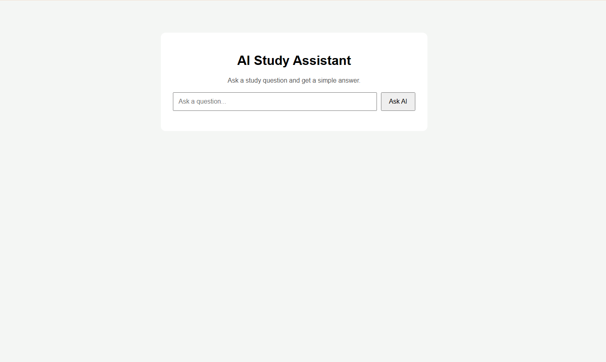
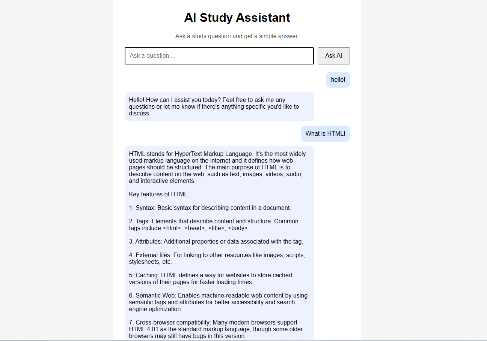

# AI Study Assistant

AI Study Assistant is a simple web application that helps students ask study questions and receive AI-generated answers.

## Features

- Ask study questions
- Get AI-powered answers
- Chat-style interface
- Loading state while AI is thinking
- Send questions with Enter key
- Local AI model using Ollama

### Home Page


### AI Chat Example


## Technologies Used

- Python
- Flask
- HTML
- CSS
- JavaScript
- Ollama

## How to Run

1. Install dependencies:

```bash
pip install flask requests
```

2. Start Ollama model:

```bash
ollama run qwen2.5:0.5b
```

3. Run the Flask app:

```bash
python app.py
```

4. Open in browser:

```text
http://127.0.0.1:5000
```

## Project Goal

This project was created to practice full-stack web development and AI integration using a local language model.
